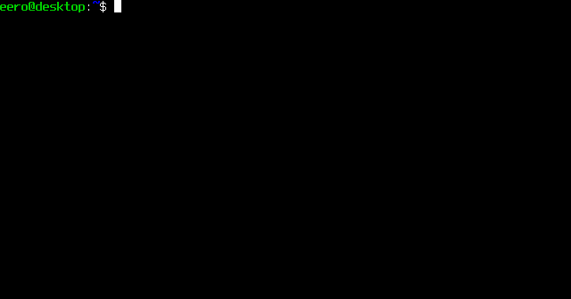

# ODE abnormals

This is a companion repository to the paper [ODE trajectories as abnormal curves in Carnot groups](https://hakavuori.fi/publication/ode-abnormals/). It contains an implementation to compute abnormal covectors for lifts of trajectories of ODE systems in Carnot groups. The computations for the examples of the paper are also included.

## Usage

### Prerequisites

A working installation of [SageMath](https://www.sagemath.org/) is needed. The code has been tested to work on version 9.0, released 2020-01-01.

### Clone

Clone the repo with
```shell
$ git clone https://github.com/ehaka/ode-abnormals
```

### Test an example

Test any of the examples in the `examples` subfolder, for instance
```shell
$ cd ode-abnormals
$ cd examples
$ sage logarithmic_spiral.sage
```

### The `ode_abnormals` package

There is no separate installation, everything assumes that the package `ode_abnormals` is found in `sys.path`. E.g. in `examples/logarithmic_spiral.sage` this is guaranteed with the preamble
```
import sys
import pathlib
path = pathlib.Path().absolute().parent
sys.path.append(str(path))
```
Here the assumption is that `pathlib.Path().absolute()` refers to the folder `ode-abnormals/examples`, so the folder added to path is `ode-abnormals`.

Note that `sys.path` when running Sage is different from `$PATH`.

### Use with Sage and the Sage notebook

The easiest way to use the package within Sage is to directly launch Sage in the main folder of the repo
```shell
$ cd ode-abnormals
$ sage
```
Similarly for the Sage notebook

```shell
$ cd ode-abnormals
$ sage --notebook=jupyter
```
Then the functions in the `ode_abnormals` package can be imported with
```
sage: from ode_abnormals import *
```

Otherwise, the repo folder can be added to `sys.path` for the duration of a Sage session with `sys.path.append(PATH-TO-ODE-ABNORMALS-DIRECTORY)` command.


## Computing abnormal covectors for ODE trajectories



Copying any of the scripts in the `examples` subfolder is the easiest way to compute examples. The barebones structure is the following.

Define variables in a polynomial ring with coefficients in some ring, e.g. the rationals `QQ`
```
sage: R.<x,y> = QQ[]
sage: variables = [x, y]
```

Define the ODE system as a list of polynomials in the order of the variables.
```
sage: equations = [1-y, x] # dx/dt = 1-y, dy/dt = x
```

Run the main solver.

```
sage: from ode_abnormals.ode_search import ode_search
sage: covec, auxdata = ode_search(equations, variables)
```

The first element of the output is a Python dictionary describing the covector as a dual element of a free Lie algebra.

```
sage: covec
{[X_2, [X_1, X_2]]: 1,
 [X_1, [X_1, [X_1, X_2]]]: -1,
 [X_2, [X_2, [X_1, X_2]]]: -1}
```

See the various example scripts for further features. Info on the input and output of the various functions can be accessed with the syntax
```
sage: ode_search?
```

## The examples of the paper [ODE trajectories as abnormal curves in Carnot groups](https://hakavuori.fi/publication/ode-abnormals/)

The computations for the examples section of the paper can be found in the `examples`subfolder. Precomputed outputs are available in `examples/output`, showing the resulting covectors and abnormal polynomials.

The precomputed examples are

1. A logarithmic spiral.
2. A generic homogeneous linear ODE in rank 2.
3. The Hawaiian earring.
4. The Lorenz butterfly.
5. Linear ODEs with randomly chosen integer coefficients in ranks 3 and 4.


## License

This project is licensed under the MIT License - see the [LICENSE.txt](LICENSE.txt) file for details.
